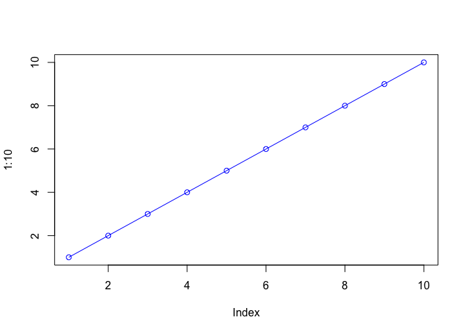
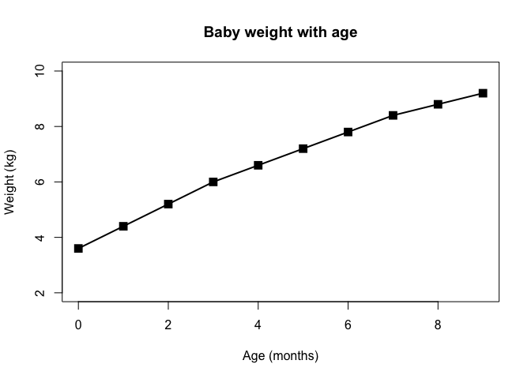
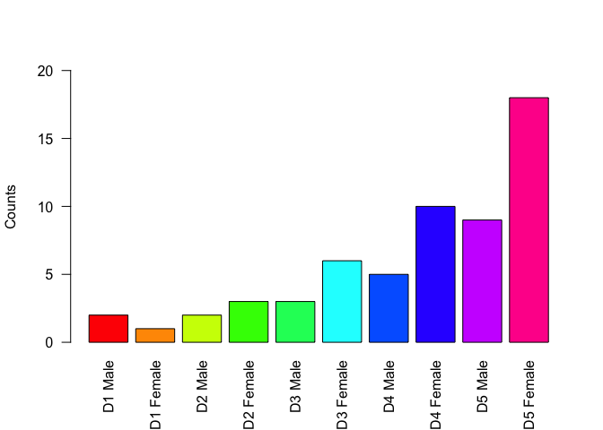
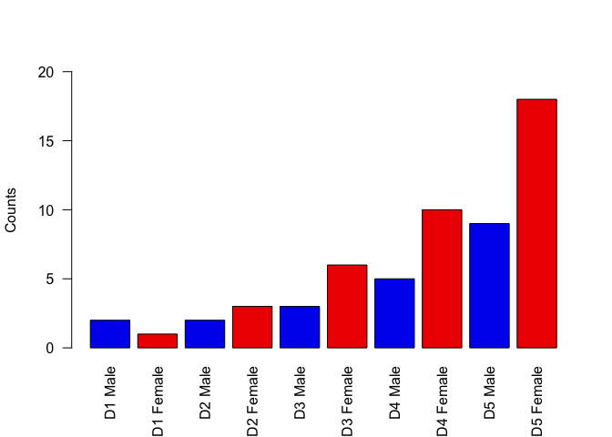

Class 5: Data Visualization and graphs in R
================
Linh-An Ho
1/23/2020

## Class 5

# Data Visualization and graphs in R

``` r
plot(1:10, col = "blue", typ = "o")
```

<!-- -->

\#Need to import/read data file first

``` r
baby <- read.table("bimm143_05_rstats/weight_chart.txt", header = 
                     TRUE)
```

\#A basic plot of age vs weight

``` r
plot(baby$Age, baby$Weight, typ = "o",
     pch = 15, cex = 1.5, lwd= 2, ylim = c(2,10), 
     xlab = "Age (months)", ylab = "Weight (kg)",
     main = "Baby weight with age")
```

<!-- -->

\#Import data for
barplot

``` r
mouse <-  read.table("bimm143_05_rstats/feature_counts.txt", header = TRUE, sep = "\t")
```

\#Plot features barplot

``` r
par(mar=c(5,10,2,1))
barplot(mouse$Count, horiz = TRUE, 
        xlab = "Mouse Count" , names.arg = mouse$Feature,las = 1)
```

<!-- -->

\#Import male/female
counts

``` r
mf <- read.table("bimm143_05_rstats/male_female_counts.txt", sep = "\t", header = TRUE)
```

\#Plot rainbow plot

``` r
barplot(mf$Count, col = rainbow(nrow(mf)),
        names.arg = mf$Sample, las=2, 
        ylab="Counts", ylim=c(0,20))
```

<!-- -->

\#Assign colors to genders on the plot

``` r
barplot(mf$Count, col = c("blue2", "red2"),
        names.arg = mf$Sample, las=2, 
        ylab="Counts", ylim=c(0,20))
```

<!-- -->
