CLass 9: Machine Learning
================
Linh-An Ho
2/4/2020

## K-means clustering

The main k-means function in R is called `kmeans()`. Let’s play with it
here.

``` r
 # Generate some example data for clustering (30 points, centered round -3/3)
tmp <- c(rnorm(30,-3), rnorm(30,3)) 

# Taking the vector of 60 things and combining the data from tmp & rev(tmp) (reverses the order of tmp)
x <- cbind(x=tmp, y=rev(tmp))

plot(x)
```

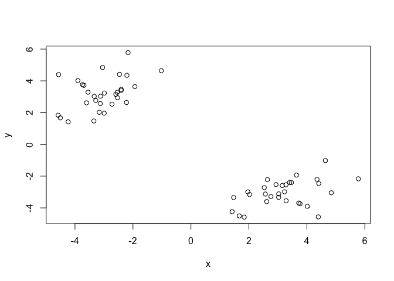<!-- -->

Use the kmeans() function setting k (centers) to 2 and nstart=20

``` r
km <- kmeans(x, centers = 2, nstart = 20)
```

Inspect/print the results

``` r
km
```

    ## K-means clustering with 2 clusters of sizes 30, 30
    ## 
    ## Cluster means:
    ##           x         y
    ## 1 -3.066389  3.195157
    ## 2  3.195157 -3.066389
    ## 
    ## Clustering vector:
    ##  [1] 1 1 1 1 1 1 1 1 1 1 1 1 1 1 1 1 1 1 1 1 1 1 1 1 1 1 1 1 1 1 2 2 2 2 2 2 2 2
    ## [39] 2 2 2 2 2 2 2 2 2 2 2 2 2 2 2 2 2 2 2 2 2 2
    ## 
    ## Within cluster sum of squares by cluster:
    ## [1] 52.42708 52.42708
    ##  (between_SS / total_SS =  91.8 %)
    ## 
    ## Available components:
    ## 
    ## [1] "cluster"      "centers"      "totss"        "withinss"     "tot.withinss"
    ## [6] "betweenss"    "size"         "iter"         "ifault"

> Q. How many points are in each cluster?

30

> Q. What ‘component’ of your result object details

  - cluster size? size
  - cluster assignment/membership? cluster

<!-- end list -->

``` r
# How many points are there in all
length(km$cluster)
```

    ## [1] 60

``` r
# Tells you how many of each (i.e. 1s and 2s) there are 
table(km$cluster)
```

    ## 
    ##  1  2 
    ## 30 30

  - cluster center? cluster means

Plot x colored by the kmeans cluster assignment and add cluster centers
as blue
points

``` r
#  Cluster assignment numbers (1 and 2) align with the color number (1=black, 2=red)
plot(x, col = km$cluster)
```

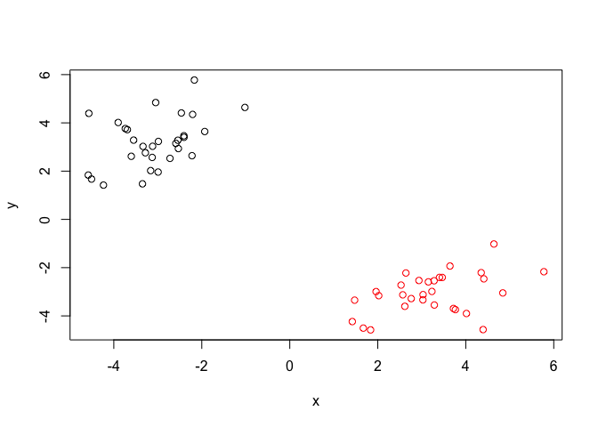<!-- -->

``` r
# Can change from the default by adding +(number)
plot(x, col = km$cluster+1)
```

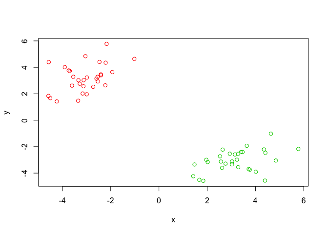<!-- -->

``` r
# Adding the cluster centers in blue
plot(x, col = km$cluster)
points(km$centers, col = "blue", pch =15)
```

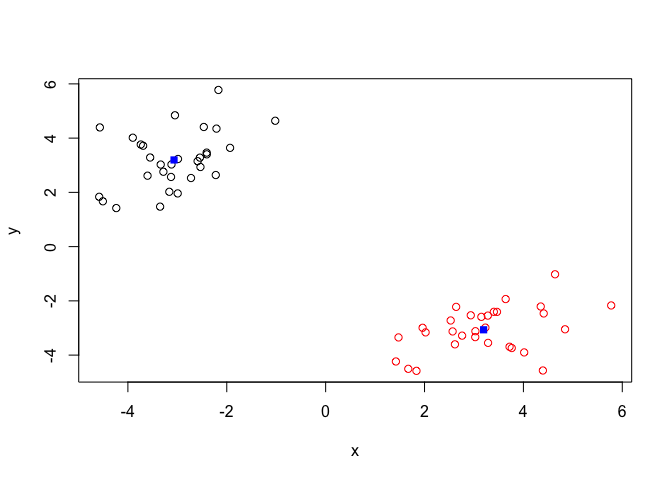<!-- -->

## Hierarchical Clustering in R

The main hierarchical clustering function in R is called `hclust()` An
important point here is that you have to calculate the distance matrix
deom your input data before calling `hclust()`

For this we will use the `dist()` function first

``` r
d <- dist(x)
hc <- hclust(d)
hc
```

    ## 
    ## Call:
    ## hclust(d = d)
    ## 
    ## Cluster method   : complete 
    ## Distance         : euclidean 
    ## Number of objects: 60

Folks often view the results of hierarchical clustering graphically.
From this graph, we get two “branches” one for each cluster (1-30) and
one for (31-60)

``` r
plot(hc)
# Draw a line across
abline(h=6, col="red", lty=2)
abline(h=4, col="blue")
```

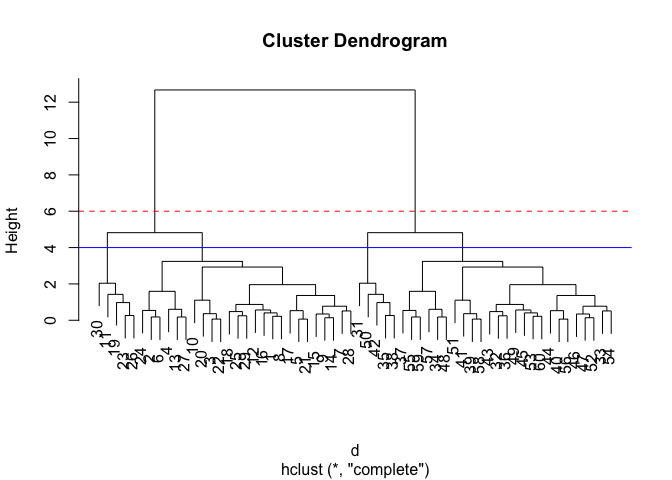<!-- -->

To get cluster membership vector I need to “cut” the tree at a certain
height to yield my separate cluster branches

``` r
# Cut by height h
cutree(hc, h=6)
```

    ##  [1] 1 1 1 1 1 1 1 1 1 1 1 1 1 1 1 1 1 1 1 1 1 1 1 1 1 1 1 1 1 1 2 2 2 2 2 2 2 2
    ## [39] 2 2 2 2 2 2 2 2 2 2 2 2 2 2 2 2 2 2 2 2 2 2

``` r
cutree(hc, h=4)
```

    ##  [1] 1 1 1 1 1 1 1 1 1 1 2 1 1 1 1 1 1 1 2 1 1 1 2 1 1 2 1 1 1 2 3 4 4 4 3 4 4 3
    ## [39] 4 4 4 3 4 4 4 4 4 4 4 3 4 4 4 4 4 4 4 4 4 4

``` r
# Can tell it to cut into desired amount of clusters
gp4 <- cutree(hc, k=6)
```

``` r
 # Step 1. Generate some example data for clustering
x <- rbind(
  matrix(rnorm(100, mean=0, sd = 0.3), ncol = 2), 
  matrix(rnorm(100, mean = 1, sd = 0.3), ncol = 2),  
  matrix(c(rnorm(50, mean = 1, sd = 0.3) ,
  rnorm(50, mean = 0, sd = 0.3)), ncol = 2)) 
colnames(x) <- c("x", "y")

# Step 2. Plot the data without clustering
plot(x)
```

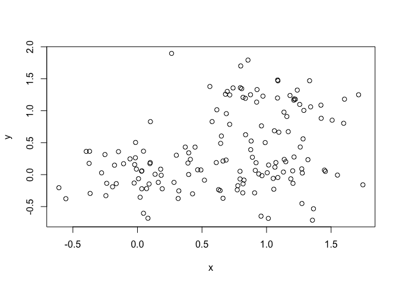<!-- -->

``` r
# Step 3. Generate colors for known clusters
# (just so we can compare to hclust results) 

col <- as.factor( rep(c("c1","c2","c3"), each=50) )
plot(x, col=col)
```

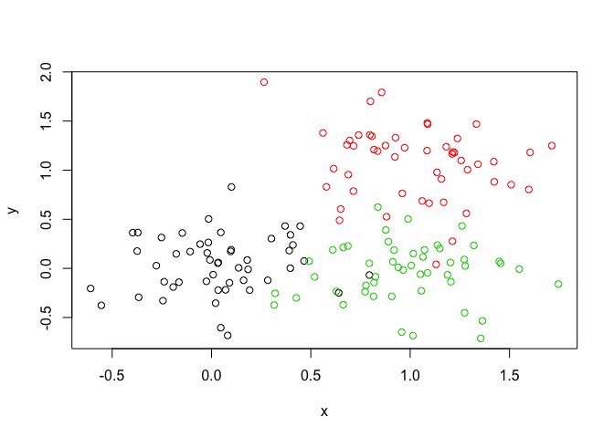<!-- -->

``` r
d <- dist(x)
hc <- hclust(d)
plot(hc)
abline(h=2, col="red")
```

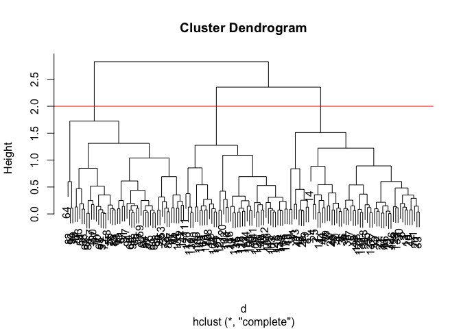<!-- -->

Use `cutree()` to get he clustership vector, and `table()` to see how
many of each are in the cluster

``` r
# Get cluster membership vector
grps <- cutree(hc, k=3)
table(grps)
```

    ## grps
    ##  1  2  3 
    ## 56 44 50

``` r
# Plot the membership vector 
plot(x, col=grps)
```

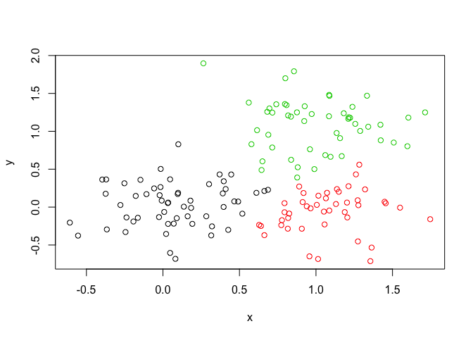<!-- -->

\#\#PCA of UK food data

``` r
x <- read.csv("UK_foods.csv", row.names = 1)
x
```

    ##                     England Wales Scotland N.Ireland
    ## Cheese                  105   103      103        66
    ## Carcass_meat            245   227      242       267
    ## Other_meat              685   803      750       586
    ## Fish                    147   160      122        93
    ## Fats_and_oils           193   235      184       209
    ## Sugars                  156   175      147       139
    ## Fresh_potatoes          720   874      566      1033
    ## Fresh_Veg               253   265      171       143
    ## Other_Veg               488   570      418       355
    ## Processed_potatoes      198   203      220       187
    ## Processed_Veg           360   365      337       334
    ## Fresh_fruit            1102  1137      957       674
    ## Cereals                1472  1582     1462      1494
    ## Beverages                57    73       53        47
    ## Soft_drinks            1374  1256     1572      1506
    ## Alcoholic_drinks        375   475      458       135
    ## Confectionery            54    64       62        41

Making plots to explore the data

Barplot

``` r
barplot(as.matrix(x), beside=T, col=rainbow(nrow(x)))
```

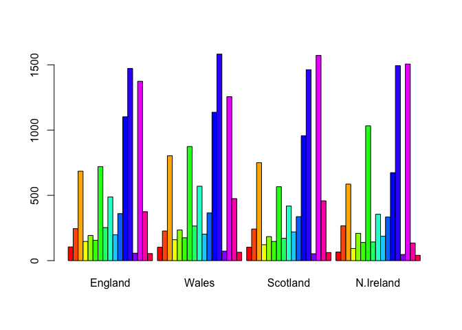<!-- -->

Pairs Plot: pairs one country on one axis and another on the other axis;
good for small datasets. The farther the points from the middle line,
the more different those data points are from each other

``` r
pairs(x, col=rainbow(10), pch=16)
```

<!-- -->

Principal Component Analysis (PCA): `prcomp()`function. “t” rotates the
data set to switch rows and columns

``` r
pca <- prcomp( t(x))
#pca
```

`attributes()` tells us what are the components available in the results
object (i.e. pca object)

``` r
attributes(pca)
```

    ## $names
    ## [1] "sdev"     "rotation" "center"   "scale"    "x"       
    ## 
    ## $class
    ## [1] "prcomp"

``` r
# plotting PCA1 and PCA2
plot(pca$x[,1], pca$x[,2], xlab= "pca1", ylab= "pca2")
text(pca$x[,1], pca$x[,2], colnames(x), col=c("black", "red", "blue", "dark green"))
```

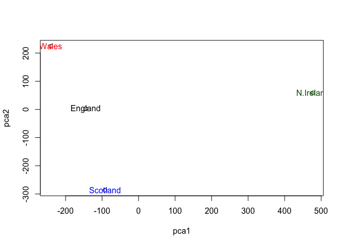<!-- -->

``` r
summary(pca)
```

    ## Importance of components:
    ##                             PC1      PC2      PC3       PC4
    ## Standard deviation     324.1502 212.7478 73.87622 4.189e-14
    ## Proportion of Variance   0.6744   0.2905  0.03503 0.000e+00
    ## Cumulative Proportion    0.6744   0.9650  1.00000 1.000e+00
