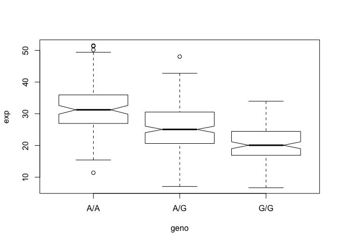

class14
================
Linh-An Ho
2/25/2020

## Analyze RNA-seq by genotype results

Here we read the results of RNA-seq for about ~230 samples (people) with
different genotypes for the rs8067378 Asthma associated SNP.

``` r
expr <- read.table("rs8067378_ENSG00000172057.6.txt")
head(expr)
```

    ##    sample geno      exp
    ## 1 HG00367  A/G 28.96038
    ## 2 NA20768  A/G 20.24449
    ## 3 HG00361  A/A 31.32628
    ## 4 HG00135  A/A 34.11169
    ## 5 NA18870  G/G 18.25141
    ## 6 NA11993  A/A 32.89721

Extract the A/A rows, i.e. where the $geno is equal to “A/A”

``` r
inds <- expr$geno == "A/A"
expr[inds,]
```

    ##      sample geno      exp
    ## 3   HG00361  A/A 31.32628
    ## 4   HG00135  A/A 34.11169
    ## 6   NA11993  A/A 32.89721
    ## 8   NA18498  A/A 47.64556
    ## 13  NA20585  A/A 30.71355
    ## 15  HG00235  A/A 25.44983
    ## 16  NA20798  A/A 34.24915
    ## 18  NA19116  A/A 35.15014
    ## 24  NA19247  A/A 24.54684
    ## 27  NA19207  A/A 49.39612
    ## 30  HG00335  A/A 28.20755
    ## 37  NA20759  A/A 28.56199
    ## 48  HG00105  A/A 51.51787
    ## 53  NA11894  A/A 38.10956
    ## 55  HG00132  A/A 31.13741
    ## 62  HG00377  A/A 39.12999
    ## 67  NA19172  A/A 32.44173
    ## 76  NA20544  A/A 34.03260
    ## 82  NA18868  A/A 36.27151
    ## 96  HG00174  A/A 26.10355
    ## 97  HG00324  A/A 19.48106
    ## 99  NA20520  A/A 38.77623
    ## 102 HG00111  A/A 40.82922
    ## 112 NA20810  A/A 46.50527
    ## 121 HG00236  A/A 33.07320
    ## 122 NA19146  A/A 25.47283
    ## 127 NA11881  A/A 29.50655
    ## 133 NA19138  A/A 27.48438
    ## 154 NA19222  A/A 35.69719
    ## 155 NA06989  A/A 32.42236
    ## 162 NA12749  A/A 28.91526
    ## 167 HG00371  A/A 19.14544
    ## 169 NA12004  A/A 22.85572
    ## 174 HG00102  A/A 31.17067
    ## 177 NA20521  A/A 27.87464
    ## 179 NA20509  A/A 27.91580
    ## 180 HG00329  A/A 16.86780
    ## 182 HG00359  A/A 23.66127
    ## 187 NA11892  A/A 28.03403
    ## 188 NA20804  A/A 36.51922
    ## 198 HG00306  A/A 27.43637
    ## 202 NA07037  A/A 35.63983
    ## 205 NA19129  A/A 38.85161
    ## 214 HG00323  A/A 22.44576
    ## 215 NA18916  A/A 37.06379
    ## 217 HG00100  A/A 35.67637
    ## 226 NA20790  A/A 50.16704
    ## 227 NA20512  A/A 37.94544
    ## 228 HG00268  A/A 29.15536
    ## 229 HG00380  A/A 28.85309
    ## 230 NA12761  A/A 38.57101
    ## 235 HG00096  A/A 30.89365
    ## 240 NA07048  A/A 39.31537
    ## 242 HG00376  A/A 31.43743
    ## 243 NA19092  A/A 35.26739
    ## 245 HG00158  A/A 22.37043
    ## 246 HG00269  A/A 28.46943
    ## 248 HG00258  A/A 30.15636
    ## 257 NA12347  A/A 35.88457
    ## 263 NA11995  A/A 32.59723
    ## 264 NA19209  A/A 36.02549
    ## 265 NA20540  A/A 23.86454
    ## 266 NA12890  A/A 28.38114
    ## 269 HG00138  A/A 25.14243
    ## 270 NA19200  A/A 51.30170
    ## 275 NA12383  A/A 28.14811
    ## 278 NA06984  A/A 29.18390
    ## 290 NA07357  A/A 27.09760
    ## 298 NA11930  A/A 33.89656
    ## 304 NA19131  A/A 33.48253
    ## 305 NA18499  A/A 15.43178
    ## 306 HG00117  A/A 29.45277
    ## 322 HG00160  A/A 26.80283
    ## 332 NA12340  A/A 43.51943
    ## 337 HG00146  A/A 45.80808
    ## 341 HG00362  A/A 26.55972
    ## 343 NA18917  A/A 24.87330
    ## 346 NA20527  A/A 29.99549
    ## 348 NA20805  A/A 26.68589
    ## 354 NA12156  A/A 39.37193
    ## 359 HG00157  A/A 38.39523
    ## 360 HG00262  A/A 41.23635
    ## 368 HG00101  A/A 27.13936
    ## 370 NA20760  A/A 36.55643
    ## 371 HG00176  A/A 28.34688
    ## 374 NA20514  A/A 15.42908
    ## 382 NA20785  A/A 47.50579
    ## 384 HG00253  A/A 30.15754
    ## 386 HG00339  A/A 34.88439
    ## 389 NA18861  A/A 29.29955
    ## 390 NA20539  A/A 32.87767
    ## 400 HG00145  A/A 43.43665
    ## 401 NA19225  A/A 26.56050
    ## 405 HG00379  A/A 21.87746
    ## 408 NA18907  A/A 33.42582
    ## 409 NA19204  A/A 25.38406
    ## 412 NA20770  A/A 18.20442
    ## 420 HG00104  A/A 21.62336
    ## 424 NA20786  A/A 35.80093
    ## 426 NA20756  A/A 32.26844
    ## 433 NA12762  A/A 34.40756
    ## 442 HG00159  A/A 23.99631
    ## 443 NA20811  A/A 11.39643
    ## 448 HG01791  A/A 35.24632
    ## 451 HG00182  A/A 23.38376
    ## 456 NA12750  A/A 34.94395
    ## 459 HG00108  A/A 31.92036
    ## 461 NA19130  A/A 44.27738

Calculate the different boxplots values

``` r
summary(expr[inds,]$exp)
```

    ##    Min. 1st Qu.  Median    Mean 3rd Qu.    Max. 
    ##   11.40   27.02   31.25   31.82   35.92   51.52

Extract the G/G rows

``` r
inds <- expr$geno == "G/G"
expr[inds,]
```

    ##      sample geno      exp
    ## 5   NA18870  G/G 18.25141
    ## 9   HG00327  G/G 17.67473
    ## 17  NA12546  G/G 18.55622
    ## 20  NA18488  G/G 23.10383
    ## 23  NA19214  G/G 30.94554
    ## 28  HG00112  G/G 21.14387
    ## 29  NA20518  G/G 18.39547
    ## 31  NA19119  G/G 12.02809
    ## 32  HG00247  G/G 17.44761
    ## 35  NA20758  G/G 29.82254
    ## 41  NA12249  G/G 23.01983
    ## 46  HG00320  G/G 13.42470
    ## 47  NA11843  G/G 22.65437
    ## 49  NA20588  G/G 11.07445
    ## 50  NA20510  G/G 28.35841
    ## 56  HG00118  G/G 28.79371
    ## 57  NA18520  G/G 27.08956
    ## 61  NA12234  G/G 16.11138
    ## 72  NA19152  G/G 26.61928
    ## 73  NA20761  G/G 30.18323
    ## 77  NA18923  G/G 19.40790
    ## 79  HG00238  G/G 19.52301
    ## 85  NA12058  G/G 26.56808
    ## 89  HG00129  G/G 17.34076
    ## 92  HG00183  G/G 10.74263
    ## 93  HG00109  G/G 16.66051
    ## 104 NA18517  G/G 29.01720
    ## 105 NA20801  G/G 20.69333
    ## 106 NA20529  G/G 21.15677
    ## 109 HG00349  G/G 18.58691
    ## 110 HG00234  G/G 19.04962
    ## 111 NA19248  G/G 22.81974
    ## 114 NA12813  G/G 32.01142
    ## 115 NA20537  G/G 21.12823
    ## 117 HG00332  G/G 18.61268
    ## 118 HG00152  G/G 19.37093
    ## 119 NA20783  G/G 31.42162
    ## 128 HG00185  G/G 16.67764
    ## 132 NA20531  G/G 19.08659
    ## 135 HG00277  G/G 21.55001
    ## 140 HG00336  G/G  8.29591
    ## 143 NA20581  G/G 12.58869
    ## 150 NA20538  G/G 17.34109
    ## 153 NA20814  G/G 28.23642
    ## 156 NA19171  G/G 19.99979
    ## 159 HG00141  G/G 25.55413
    ## 163 NA19190  G/G 24.45672
    ## 166 NA10851  G/G 23.53572
    ## 170 HG00116  G/G 22.48273
    ## 171 NA12272  G/G 14.66862
    ## 172 NA19096  G/G 33.95602
    ## 175 NA19236  G/G 18.26466
    ## 178 HG00345  G/G 16.06661
    ## 190 HG00156  G/G 17.32504
    ## 193 HG00282  G/G 19.14766
    ## 194 HG00343  G/G 12.57599
    ## 195 HG00139  G/G 22.28749
    ## 199 HG00232  G/G 17.29261
    ## 201 HG00122  G/G 24.18141
    ## 207 NA19149  G/G 16.07627
    ## 211 HG00189  G/G 14.80495
    ## 218 HG00126  G/G 23.46573
    ## 224 HG00265  G/G 28.97074
    ## 225 HG00378  G/G 27.78837
    ## 232 NA20796  G/G 23.92355
    ## 233 NA12399  G/G  9.55902
    ## 239 HG00099  G/G 12.35836
    ## 241 NA19114  G/G 22.53910
    ## 247 NA19210  G/G 21.98118
    ## 250 HG00276  G/G 16.40569
    ## 253 HG00181  G/G 25.21931
    ## 254 HG00346  G/G 24.32857
    ## 259 HG00142  G/G 19.42882
    ## 261 HG00315  G/G 26.56993
    ## 267 HG00250  G/G 13.34557
    ## 268 NA20769  G/G 16.60507
    ## 271 NA19144  G/G 24.85165
    ## 272 NA12815  G/G 21.56943
    ## 280 NA19175  G/G 23.95528
    ## 283 NA18519  G/G 16.18962
    ## 285 NA20535  G/G 22.53720
    ## 287 HG00260  G/G 26.04123
    ## 288 HG00372  G/G  6.67482
    ## 292 HG00261  G/G 20.07363
    ## 293 HG00273  G/G 19.76527
    ## 299 HG00358  G/G 18.50772
    ## 307 NA19121  G/G 20.14146
    ## 308 NA20515  G/G 18.07151
    ## 314 NA10847  G/G  6.94390
    ## 316 NA12400  G/G 22.14277
    ## 319 HG00342  G/G 14.23742
    ## 330 HG00136  G/G 19.85388
    ## 340 NA20765  G/G 27.73467
    ## 344 NA18502  G/G 19.02064
    ## 351 NA20772  G/G 14.49816
    ## 355 HG00257  G/G 26.78940
    ## 356 NA18486  G/G 20.84709
    ## 357 HG00188  G/G 10.77316
    ## 361 HG00280  G/G 12.82128
    ## 362 HG00308  G/G 16.90256
    ## 364 NA18910  G/G 29.60045
    ## 369 HG00281  G/G 14.81945
    ## 373 NA12275  G/G 17.46326
    ## 375 HG00351  G/G 23.26922
    ## 376 HG00186  G/G 21.39806
    ## 378 HG00275  G/G 18.06320
    ## 379 HG00325  G/G 15.91528
    ## 380 NA19118  G/G 24.80823
    ## 381 HG00124  G/G 26.04514
    ## 383 HG02215  G/G 18.28089
    ## 385 HG00134  G/G 23.24907
    ## 391 NA11931  G/G 17.91118
    ## 393 HG00120  G/G 21.09502
    ## 421 NA20582  G/G 24.74366
    ## 428 NA12889  G/G 27.40521
    ## 435 NA12006  G/G 24.85772
    ## 436 NA19108  G/G 23.08482
    ## 446 NA07346  G/G 16.56929
    ## 454 HG00154  G/G 16.69044
    ## 457 HG00233  G/G 25.08880
    ## 458 HG00131  G/G 32.78519

Calculate the different boxplots values

``` r
summary(expr[inds,]$exp)
```

    ##    Min. 1st Qu.  Median    Mean 3rd Qu.    Max. 
    ##   6.675  16.903  20.074  20.594  24.457  33.956

Make a
boxplot

``` r
boxplot(exp~geno, data = expr, notch=TRUE)
```

<!-- -->

``` r
#if the notches don't overlap, this indicates that the data is statistically significant
```
