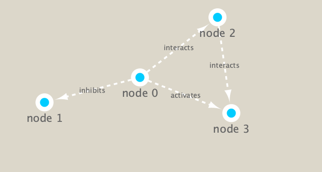

```{r setup, include=FALSE}
knitr::opts_chunk$set(echo = TRUE)
```

## Setup
First setup the packages we need. These include **igraph** from CRAN (**install.packages("igraph")**) and **RCy3** from bioconductor (**BiocManager::("RCy3")**).

```{r}
library(RCy3)

# Test the connection to Cytoscape.
cytoscapePing()
```
```{r}
# Check the version
cytoscapeVersionInfo()
```
```{r}
g <- makeSimpleIgraph()
createNetworkFromIgraph(g, "myGraph")
```

Play with representations in Cytoscape
```{r}
setVisualStyle("Marquee")
```
Save image in our document.
```{r}
fig <- exportImage(filename="demo", type="png", height=350)
```

```{r}

```

We can also plot this simple network in R itself.
```{r}
plot(g)
```

## Read our metagenomics data

Our data from today comes from the TARA oceans study.
```{r}
# Scripts for processing located in "inst/data-raw/"
prok_vir_cor <- read.delim("virus_prok_cor_abundant.tsv", stringsAsFactors = FALSE)

# Have a peek at the first 6 rows
head(prok_vir_cor)
```

How many connections (i.e. edges) do we have in our network?
```{r}
nrow(prok_vir_cor)
```

Use the igraph function to make a network from this data.frame
```{r}
library(igraph)
g <- graph.data.frame(prok_vir_cor, directed = FALSE)
plot(g)
```

Let's turn the node/vertex labels off and change the size.
```{r}
 plot(g,vertex.size = 3, vertex.label=NA)
```

To send to Cytoscape, we can use the command:

```{r}
createNetworkFromIgraph(g, "myIgraph")
```

## Network community detection

Let's cluster our network to find "community" structure.

```{r}
cb <- cluster_edge_betweenness(g)
cb
```

```{r}
plot(cb, y=g, vertex.label=NA,  vertex.size=3)
```


```{r}
pr <- page_rank(g)
head(pr$vector)
```


